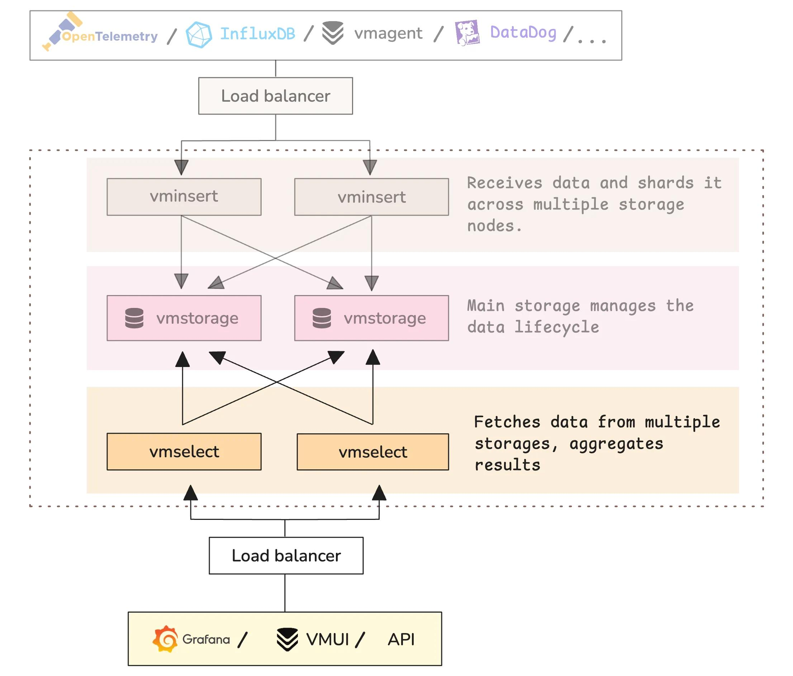

here i have migrated from prometheus to victorimetrics 
why i have migrate because it has scalability, performance, storage etc and alsp hold data for longer durations
 
first i have installed prometheus, kube-state-metrics, grafana, vmagnet, victoriamterics 

## victoriaMetrics Cluster SeUp

Deployed:

-> vminsert (Receives incoming metrics data and sends it to storage nodes.)

-> vmstorage (Stores compressed time-series data on disk)

-> vmselect (Handles queries and fetches data from storage)

## When data reaches VictoriaMetrics:

data comes via /api/v1/write in time series format
First stored in RAM and grouped by metric name, labels 
data compresed heavily and written to disk in chunks
create inddexes forlabels, metric names

Kubernetes itself doesn’t give Prometheus-format metrics directly. so we use kube-state-metrics

vmagent pull metrics from kube-state-metrics, node-exporter(prometheus) and other end ponts.

vmagent does NOT store long-term data, so it sends data to victoriametrics or 

Prometheus → remote_write → VictoriaMetrics

## Check this and how to start

kubectl get pods -n monitoring 

kubectl get svc -n monitoring

prometheus, grafana, victoriametric components (vminsert, vselect, vmstorage), statemetrics, vmagent are running

## configure prometheus (Remote_write) before scrapconfig

kubectl edit configmap my-prometheus-server -n monitoring

add this 

remote_write: 

  - url: http://vmcluster-victoria-metrics-cluster-vminsert:8480/insert/0/prometheus

kubectl rollout restart deployment my-prometheus-server -n monitoring

Prometheus → VictoriaMetrics data flow enabled

## Verify the data in victoriaMetrics

kubectl exec -it vmcluster-victoria-metrics-cluster-vmselect-6788b75d86-w6fmm -n monitoring -- wget -qO- "http://192.168.250.206:8481/select/0/prometheus/api/v1/query?query=up"

## Deploy and configure 

check vmagent:   kubectl get deployment vmagent-victoria-metrics-agent -n monitoring

kubectl edit configmap vmagent-victoria-metrics-agent-config -n monitoring

  scrape.yml: | 

    global: 

      scrape_interval: 15s 

      scrape_configs: 
      
      - job_name: 'kubernetes-nodes' 

        kubernetes_sd_configs: 

        - role: node 

        - job_name: 'kubernetes-pods' 

        kubernetes_sd_configs: 

        - role: pod 

        - job_name: 'kube-state-metrics' 

        static_configs: 

        - targets: ['my-prometheus-kube-state-metrics:8080'] 
        
      - job_name: 'node-exporter' 

        static_configs:

        - targets:

          - my-prometheus-prometheus-node-exporter:9100

kubectl rollout restart deployment vmagent-victoria-metrics-agent -n monitoring

## Grafana  ->   connections -> Data source -> prometheus -> url

http://vmcluster-victoria-metrics-cluster-vmselect:8481/select/0/prometheus

15661 Dashboard id:

## Replace 

remove origin_prometheus=~"$origin_prometheus" 

change origin_prometheus: vmagent

change "uid": "prometheus" ->"uid": "victoriaMetrics"

## Final Data Flow

Prometheus -> Remote_write -> VictoriaMetrics

vmagent -> scrape -> VictorialMetrics

Grafana -> Query -> prometheus 

Grafana -> Query -> VictoriaMetrics